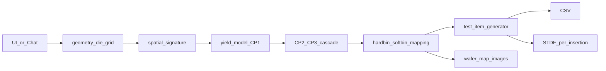

# Wafer Map Spec Implementation Plan

## Gap analysis (spec vs. current code)

Already covered: die grid with edge exclusion ([geometry.py](geometry.py)), 29 spatial signatures with reticle/repeater support ([signatures.py](signatures.py)), notch/flat rendering ([renderer.py](renderer.py)), CSV/PNG/ZIP/STDF exports ([app.py](app.py), [stdf_writer.py](stdf_writer.py)), chat + manual UI.

Missing (must-have): spec-compliant geometry limits and auto flat/notch, direct-yield / defect-density yield model, CP1–CP3 insertion cascade, configurable hardbin/softbin counts, parametric test items, auto stepping field, soft repeaters, striping.

Missing (nice-to-have): fab lot numbering, lot time sequences, test time, multi-site, S2S yield loss.

## Data flow after changes

## Phase 1 — Geometry and lot constraints (must-have)

Changes in [geometry.py](geometry.py), [app.py](app.py), [llm_agent.py](llm_agent.py), [renderer.py](renderer.py):

- Wafer diameter becomes a 150/200/300 mm choice (replace free `number_input` in `_render_manual_page`).
- Auto-select edge type from diameter: 150 mm = flat, 200/300 mm = notch (override still possible).
- Edge exclusion range 1–10 mm (slider currently caps at 5).
- Die size 1x1 to 25x35 mm with aspect-ratio validation (reject ratios outside 1:2 to 2:1) in both the manual form and `request_to_config`.
- Scribe street: default 0.1 mm, selectable 0.05–0.2 mm (currently defaults to 0).
- Flat orientation: renderer only draws the flat at the bottom; generalize `_draw_single_wafer` so flat supports bottom/top/left/right like the notch already does (rename `notch_orientation` usage to a shared orientation field).
- Wafer quantity: cap `MAX_WAFERS` at 25 (currently 100) and keep sequential 1..N numbering.

## Phase 2 — Yield model and CP insertions (must-have)

New module `yield_model.py`:

- Two yield inputs: direct yield %, or defect density D with `Y = exp(-A * D)` (A = die area in cm2).
- The spatial signature determines *which* dies fail first; the yield model then adds/removes random failures so wafer yield converges on the target. Signature dies keep their signature bins; yield-model kills get a random-fail bin.
- CP insertion cascade (1, 2, or 3 insertions selectable):
  - CP1 pass/fail from yield model + signature.
  - CP2 yield = uniform(90%, 99.9%) of CP1; only CP1 passers can pass CP2.
  - CP3 same rule applied to CP2.
- Output shape: per-insertion die results, so `all_wafers` becomes per-insertion lists. CSV gains an `Insertion` column (CP1/CP2/CP3); STDF export writes one file per insertion (zipped together) since a real sort run produces one STDF per insertion, with `TEST_COD`/`TST_TEMP` in the MIR distinguishing them.

## Phase 3 — Hardbin / softbin configuration (must-have)

Changes in [signatures.py](signatures.py), [stdf_writer.py](stdf_writer.py), new mapping helper:

- Hardbin count selection: 16, 64, or 256. Softbin count = hardbins x4, x16, or x64.
- Keep `BIN_DEFINITIONS` (bins 1–29) as the internal signature/color layer; add a mapping step that translates each internal bin to an exported hardbin number within the chosen range (pass = bin 1, each fail cause mapped to a stable hardbin) and assigns a softbin in the softbin range (no strict mapping needed per spec).
- `write_stdf` currently sets `soft_bin = hard_bin` and emits HBR/SBR from bin 1–29 directly — update to use the mapped numbers and emit HBR/SBR for the configured bin set.

## Phase 4 — Test items / parametric data (must-have)

New module `test_items.py`:

- Test count: 100 / 1,000 / 10,000... (orders of magnitude dropdown; default 100). Warn on estimated STDF size — 1,000 PTRs x ~700 dies x 25 wafers is tens of millions of records, so show an estimate and cap the UI at a sane default.
- Pass/Fail vs Parametric split: default 50/50, selectable in 10% steps.
- Pass/Fail items emit 0/1 (STDF FTR or PTR with 0/1); parametric items emit RNG reals 0.0–1.0 with options: exponential (`10**rng`), quantized (0.2 steps), signed (-1..+1), scientific notation range, constant value.
- Failing dies fail at least one test item; passing dies pass all.
- Test names: `PARAM_0001` with leading zeros (default). Nice-to-have verbose modes (31/63/127/255 chars, suffix-only differentiation, 8-char gibberish chunks) as a naming-style dropdown.
- STDF: add PTR (and TSR summary) records to [stdf_writer.py](stdf_writer.py); parametric results also exportable as a long-format CSV.

## Phase 5 — Stepping-field yield patterns (must-have)

Changes in [signatures.py](signatures.py), [geometry.py](geometry.py):

- Auto-generate stepping field from die size (spec: users enter die size, not reticle config). Fit as many dies as possible into a max ~26x33 mm field; replace the fixed `dies_per_reticle_x/y = 2` defaults with this computed value (manual override stays).
- Soft repeaters: extend `assign_reticle` with a fail-rate parameter (10–100% in 10% steps) instead of always-fail.
- New "Striping" signature: fail (hard or soft) all dies along one edge (top/bottom/left/right) of every stepping field. Wire into `SIGNATURE_NAMES`, `compose_signatures`, the LLM schema, and the keyword parser.

## Phase 6 — Nice-to-haves

- Fab lot numbers: `FYYWWSSSS` generator (fab letter, 2-digit year, work week 1–53, 4-digit sequence) plus split-lot suffixes (.01, .02); offered as an "auto lot ID" option next to the free-text field.
- Lot sequences: generate N lots with sort-start timestamps spaced per month/week/day/multiple-per-day; timestamps flow into MIR `START_T`, WIR/WRR, and the CSV `start_time` column (currently always `datetime.now()`).
- Test time: 1–600 s per touchdown; drives per-die `TEST_T` in the PRR (currently hardcoded 0) and wafer start/finish times.
- Multi-site: site count auto from gross die per wafer (<200:1, 200–399:2, 400–799:4, 800–1599:8, 1600+:16), site layout patterns (side-by-side, stacked, 2x2/2x4 block, checkerboard, diagonal), per-die `SITE_NUM` in PIR/PRR, and an SDR record.
- Site-to-site yield loss: optional per-site factor 0.0–1.0 multiplied into the yield model (healthy = all sites > 0.95).
- Repair: skip (spec marks it a placeholder).

## Cross-cutting

- Every new parameter gets: manual-form control in [app.py](app.py), field in `WaferGenRequest` + LLM function schema + keyword-parser fallback in [llm_agent.py](llm_agent.py).
- CSV schema grows: `Insertion`, `HardBin`, `SoftBin`, `Site`, timestamps. Existing columns stay for backward compatibility with Exensio demo loaders.

## Suggested order

Phases 1, 2, 3 are the core "must-have" milestone (correct geometry, yield, insertions, bins). Phase 4 (test items) is the biggest single chunk and can follow. Phase 5 is small. Phase 6 items are independent and can be picked individually.